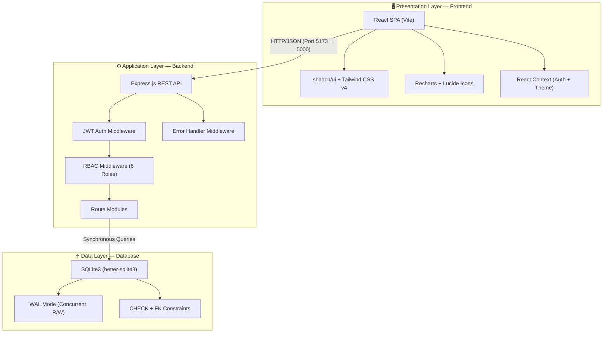
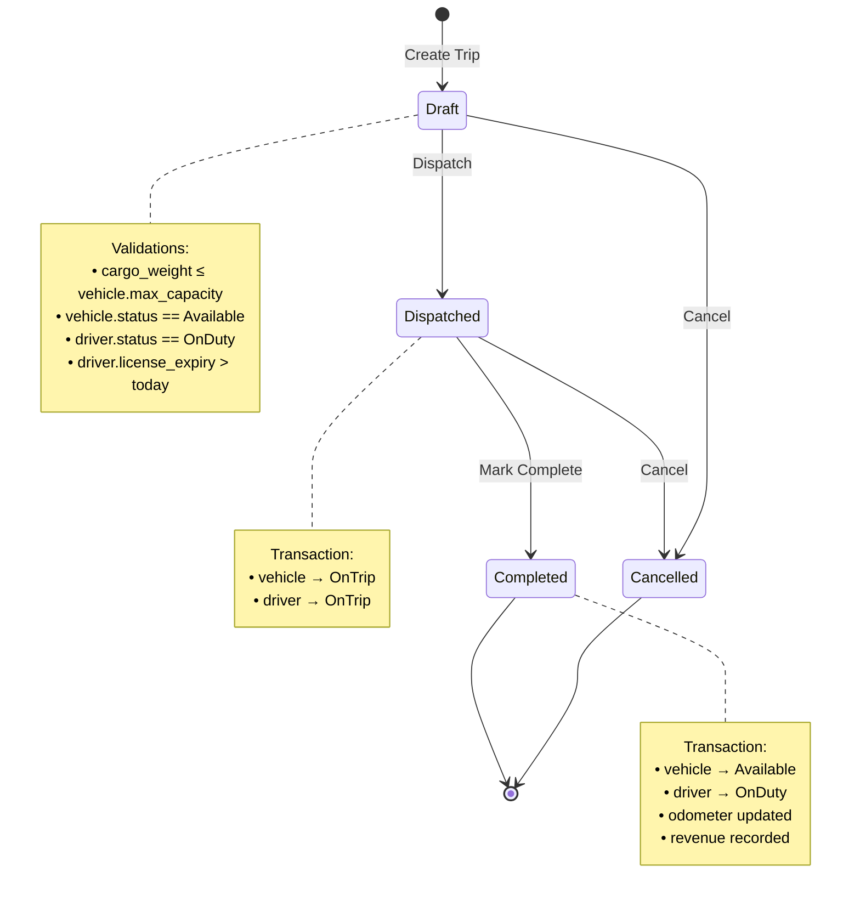
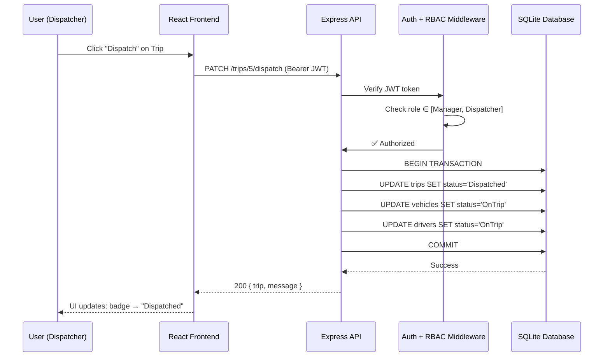
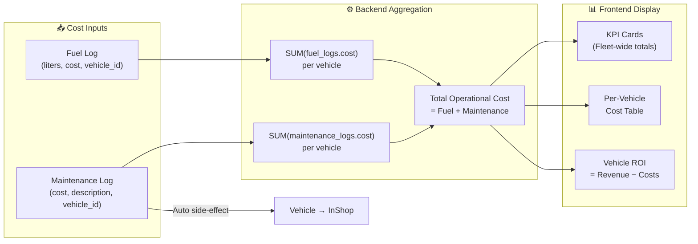

# FleetFlow — Intelligent Fleet Management System


FleetFlow is a comprehensive, rule-based digital hub for transportation companies to govern their vehicle fleet, optimize operational lifecycles, and track detailed financial performance.

## 🚀 Key Features

### 🏢 Six-Role RBAC System

A robust Role-Based Access Control system granting precise permissions for 6 distinct user profiles:

- **Super Admin:** Unrestricted system access, user management, and global configuration control.

- **Fleet Manager:** Global oversight, vehicle health, lifecycle tracking, and financial analytics.
- **Dispatcher:** Real-time trip creation, assignment logistics, and cargo capacity validation.
- **Safety Officer:** Driver compliance tracking, license expiry validation, and safety scoring.
- **Financial Analyst:** Complete financial visibility, operational costs (fuel + maintenance), and ROI analysis.
- **Driver:** Dedicated mobile-friendly portal to view dispatched trips, update status, and confirm delivery completions with final odometer readings.

### 📱 Responsive Design & Cross-Device Support

- Fully responsive mobile-first UI scaling seamlessly from smartphones to 4K desktops.
- Collapsible sidebar with intuitive hamburger menu for mobile navigation.
- Smart data tables wrapped in horizontal scroll containers to prevent breakage on tiny screens.
- Context-aware layouts stack elements logically based on device width.

### 📊 Real-Time Analytics & Dashboard

- Live KPIs tracking Active Fleet out on trips, vehicles In Maintenance, Fleet Utilization rates, and Pending Cargo loads.
- Interactive filtering by Vehicle Type, Status, and Region.
- Beautiful, auto-updating charts for monthly revenue trends and regional distributions.


### 🚛 Intelligent Trip Dispatcher

- Validates cargo weight against the assigned vehicle's maximum capacity.
- Validates driver compliance (blocks assigning drivers with expired licenses).
- Enforces strict trip lifecycle states: `Draft` → `Dispatched` → `Completed` / `Cancelled`.
- Automatically changes driver/vehicle status to `OnTrip` upon dispatch, and frees them upon competition.

### 💰 Expense & Operational Cost Tracking

- Consolidated view of all **Fuel Logs** (liters, cost, date, km/L efficiency) and **Maintenance Logs**.
- Automatic calculation of the **Total Operational Cost** (Fuel + Maintenance) computed per vehicle.
- Automatic status update to `InShop` when a new maintenance log is recorded.

### 📑 Reporting & Exports

- **CSV Exports:** Instantly generate downloadable CSV reports outlining vehicle data, logs, and rosters.
- **Formal Audit PDF Report:** Generates a structured, multi-page formal audit document complete with headers/footers, financial charts, vehicle history, driver rosters, and trip logs dynamically formatted to avoid page clipping.


---

## 🛠️ Technology Stack

**Frontend**

- **Framework:** React + Vite (Fast HMR and optimized builds)
- **Styling:** Tailwind CSS v4 + `shadcn/ui` for premium, accessible, and responsive components.
- **Charts & Icons:** Recharts for dynamic analytics, `lucide-react` for crisp vector icons.
- **Routing:** Component-driven state and view management.

**Backend**

- **Runtime:** Node.js (v20+)
- **Framework:** Express.js (RESTful API with robust error handling middleware)
- **Database:** SQLite3 (`better-sqlite3` for high-performance synchronous queries, WAL mode enabled)
- **Security:** JWT (`jsonwebtoken`) for stateless session authentication and `bcryptjs` for secure password hashing.

---

## 🏗️ System Architecture

FleetFlow follows a **three-layer client-server architecture**, optimized for rapid deployment and high performance:



| Layer            | Technology                                         | Purpose                                              |
| ---------------- | -------------------------------------------------- | ---------------------------------------------------- |
| **Presentation** | React + Vite, Tailwind CSS v4, shadcn/ui, Recharts | SPA with role-filtered views, live KPI cards, charts |
| **Application**  | Express.js, JWT, bcryptjs                          | REST API, authentication, RBAC, business rules       |
| **Data**         | SQLite3, better-sqlite3, WAL mode                  | Persistent storage with CHECK/FK constraints         |

---

## 📐 Database Schema (ER Diagram)

```mermaid
erDiagram
    USERS {
        int id PK
        text name
        text email UK
        text password_hash
        text role "Super Admin | Manager | Dispatcher | Safety Officer | Financial Analyst | Driver"
    }

    REGIONS {
        int id PK
        text name UK
    }

    VEHICLES {
        int id PK
        text model
        text type "Truck | Van | Bike | Car"
        text license_plate UK
        int max_capacity
        int odometer
        real acquisition_cost
        text status "Available | OnTrip | InShop | Retired"
        int region_id FK
    }

    DRIVERS {
        int id PK
        text name
        text license_type
        text license_expiry
        text status "OnDuty | OffDuty | OnTrip | Suspended"
        int region_id FK
    }

    TRIPS {
        int id PK
        int vehicle_id FK
        int driver_id FK
        real cargo_weight
        text start_location
        text end_location
        int start_odometer
        int end_odometer
        real revenue
        text status "Draft | Dispatched | Completed | Cancelled"
    }

    FUEL_LOGS {
        int id PK
        int vehicle_id FK
        int trip_id FK
        real liters
        real cost
        int odometer_reading
        real efficiency
    }

    MAINTENANCE_LOGS {
        int id PK
        int vehicle_id FK
        text description
        real cost
        text date
    }

    REGIONS ||--o{ VEHICLES : "has"
    REGIONS ||--o{ DRIVERS : "assigned to"
    VEHICLES ||--o{ TRIPS : "used in"
    DRIVERS ||--o{ TRIPS : "drives"
    VEHICLES ||--o{ FUEL_LOGS : "consumes"
    VEHICLES ||--o{ MAINTENANCE_LOGS : "serviced"
    TRIPS ||--o{ FUEL_LOGS : "logged for"
```



---

## 🔄 Data Flow — Trip Dispatching Lifecycle



### Request Flow: Trip Dispatch



---

## 💰 Data Flow — Operational Cost Calculation



---

## ⚙️ Getting Started

### Prerequisites & Tech Stack Versions

This project uses the following specific versions for maximum compatibility:

- **Node.js:** v20.20.0 or higher.
- **Frontend:** React `18.3.1`, Vite `6.3.5`, TailwindCSS `v4.1.12`.
- **Backend:** Express `5.2.1`, SQLite3 (`better-sqlite3` `12.6.2`).
- **Package Manager:** npm (Node Package Manager).

> **🛠️ Troubleshooting Node.js Version:** If you encounter syntax errors (like `await is only valid in async functions`) or module errors when running the backend, it's highly likely due to an outdated Node.js version. We strongly recommend using **[NVM (Node Version Manager)](https://github.com/nvm-sh/nvm)** (or [nvm-windows](https://github.com/coreybutler/nvm-windows)) to easily switch to the correct version without breaking your local environment:
>
> ```bash
> nvm install 20
> nvm use 20
> node -v # Should print v20.x.x
> ```

### Installation & Easy Setup

1. **Clone the repository:**

   ```bash
   git clone <repository-url>
   cd FleetFlow
   ```

2. **Set up the Backend & Environment Variables:**

   Before starting the backend, we need to initialize the environment variables. The repository includes an `.env.example` file to make this foolproof.

   ```bash
   cd backend

   # Copy the example file to create your active .env file:
   cp .env.example .env

   # Install dependencies
   npm install

   # Seed the SQLite database with demo users, vehicles, and trips:
   node seed2.js

   # Start the Express server (runs on port 5000):
   npm run dev
   ```

3. **Set up the Frontend:**
   Open a new terminal window:

   ```bash
   cd Frontend
   npm install
   # Start the Vite development server (runs on port 5173):
   npm run dev
   ```

4. **Access the App:**
   Open your browser and navigate to `http://localhost:5173`.

### 🔐 Demo Credentials

The `seed2.js` script provisions the following users to easily explore the 6-role RBAC system:

- **Super Admin:** `superadmin@fleetflow.com` / `admin123`
- **Fleet Manager:** `admin@fleetflow.com` / `admin123`
- **Dispatcher:** `jane@fleetflow.com` / `jane123`
- **Safety Officer:** `sara@fleetflow.com` / `sara123`
- **Financial Analyst:** `frank@fleetflow.com` / `frank123`
- **Driver:** `john@driver.com` / `driver123`

---

## 🧪 Testing & E2E Validation

FleetFlow is designed with automated and manual verification in mind. End-to-End (E2E) behaviors mapped strictly from the specification document include:

- Concurrent transactional updates (e.g., dispatching simultaneously updates Trip, Vehicle, and Driver tables gracefully using SQLite WAL).
- Role-based middleware strictly rejecting unauthenticated or under-privileged requests (e.g., Financial Analysts cannot manually modify the vehicle registry).

_E2E Testing is natively supported. You can utilize platforms like Playwright or Cypress to script integrations against the defined roles and validation parameters._


